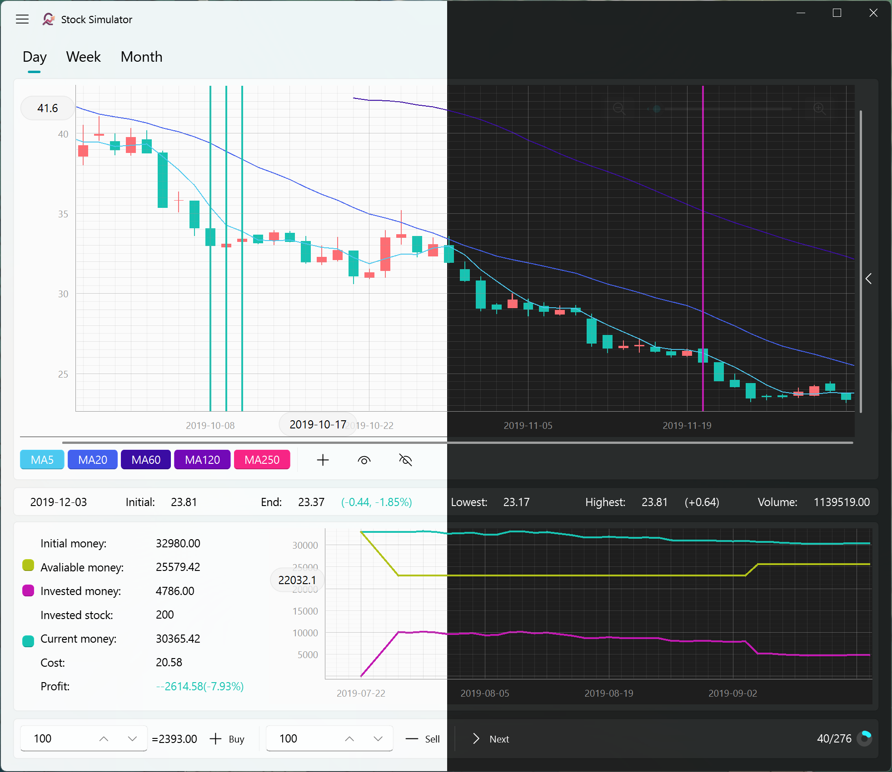

<h1 align="center">
  
  <br>QStockSimulator<br>
</h1>
<h4 align="center">Practice Your Stock Trading Skills via a Virtual Market!</h4>


## Feature

* Mullti data source supported.

* Customed trade parameters supported.

* Dark model and theme color supported (Powered by  [QFluntWidgets](https://qfluentwidgets.com/)).

## Installation and running

You can install QStockSimulator directly from git repository using pip:
```bash
git clone https://github.com/qiauil/QStockSimulator.git
pip install .
```
You could also download the release package from [Release](https://github.com/qiauil/QStockSimulator/releases).

By using the command line, you can run the simulator via `qstock` command.

## Sister Project
* [QStockPlotter](https://github.com/qiauil/QStockPlotter)